# DocChat

1. Introduction
2. Démo / liens
3. Fonctionnalités
4. Architecture générale
5. Stack technique
6. Structure du projet
7. Pipeline RAG — ingestion
8. Pipeline RAG — recherche et génération
9. API REST
10. Frontend et UX
11. Choix techniques et trade-offs
12. Installation et lancement local
13. Variables d'environnement
14. Déploiement Vercel
15. Tests
16. Jeu d'évaluation RAG
17. Limites et améliorations futures

## 1. Introduction

DocChat est une application web full stack basée sur une architecture **RAG (Retrieval-Augmented Generation)** permettant d'importer un document PDF textuel puis de poser des questions en langage naturel sur son contenu.

L'application extrait et découpe le texte du document, génère ses embeddings, recherche les passages les plus pertinents par similarité vectorielle puis utilise un LLM pour générer une réponse fondée exclusivement sur le contexte récupéré.

Chaque réponse est affichée en streaming et accompagnée des passages sources utilisés, de leur numéro de page et de leur score de similarité.

Le projet est développé avec **Next.js**, **React**, **TypeScript**, **LangChain**, **Claude**, **Gemini Embeddings** et **Chroma Cloud**.

## 2. Démo et liens

- **Application Vercel :** `(https://doc-chat-alceq4w5b-ayman-elouahi.vercel.app/)`
- **Repository GitHub :** `(https://github.com/Git2004hub/DocChat/tree/main)`

Un document PDF d'exemple ainsi qu'un jeu d'évaluation RAG sont disponibles dans le dossier [`documents/`](./documents).

## 3. Fonctionnalités

- Upload de fichiers PDF textuels avec validation du type, de la taille et des fichiers vides.
- Extraction du texte du PDF page par page.
- Découpage du contenu en chunks avec chevauchement afin de préserver le contexte.
- Conservation des métadonnées du document et des numéros de page.
- Génération d'embeddings via l'API Gemini.
- Stockage persistant des chunks et de leurs embeddings dans Chroma Cloud.
- Recherche vectorielle par similarité cosine.
- Filtrage des résultats par document.
- Génération de réponses avec Claude à partir des seuls passages récupérés.
- Indication explicite lorsque l'information demandée n'est pas présente dans le document.
- Interface de chat avec historique de la session.
- Réponse du LLM affichée progressivement grâce au streaming SSE.
- Affichage des chunks sources, des pages et des scores de similarité.
- Feedback visuel pendant le traitement du document.
- Affichage Markdown des réponses générées.
- Support multilingue du pipeline, notamment testé avec des documents et questions en français et en arabe.
- Tests ciblés du chunking et de la construction du prompt.

## 4. Architecture générale

DocChat est organisé autour de deux pipelines principaux :

1. **Pipeline d'ingestion**, exécuté lors de l'upload d'un PDF.
2. **Pipeline de recherche et génération**, exécuté lorsqu'une question est envoyée dans le chat.

```mermaid
flowchart TD
    subgraph Ingestion["Pipeline d'ingestion"]
        A[PDF] --> B["POST /api/upload"]
        B --> C["Parsing PDF<br/>pdf.ts"]
        C --> D["Chunking<br/>chunking.ts"]
        D --> E["Embeddings<br/>Gemini"]
        E --> F["Stockage vectoriel<br/>Chroma Cloud"]
    end

    subgraph QA["Pipeline de recherche et génération"]
        G[Question utilisateur] --> H["POST /api/chat"]
        H --> I["Embedding de la question<br/>Gemini"]
        I --> J["Recherche vectorielle<br/>Chroma Cloud"]
        J --> K["Top-K chunks + scores"]
        K --> L["Construction du prompt"]
        L --> M["Claude / Anthropic"]
        M --> N["Streaming SSE"]
        N --> O["Frontend<br/>Réponse + Sources"]
    end
```

### Flux d'ingestion

Lorsqu'un PDF est envoyé :

PDF
→ extraction du texte page par page
→ découpage en chunks
→ génération des embeddings
→ stockage dans Chroma Cloud

### Flux de question-réponse

Lorsqu'une question est posée :

Question
→ embedding de la question
→ recherche des chunks similaires
→ construction du contexte et du prompt
→ génération avec Claude
→ streaming de la réponse et affichage des sources

Cette séparation permet de garder les différentes responsabilités indépendantes et facilite les tests, la maintenance ainsi qu'une éventuelle évolution de la solution.

## 5. Stack technique

**Couche**	            **Technologie**	                **Rôle**
Frontend	            Next.js, React, TypeScript	    Interface utilisateur et gestion du chat
Style	                Tailwind CSS	                Mise en forme responsive de l'interface
Backend	                Next.js Route Handlers, Node.js	Endpoints REST et orchestration du pipeline
Parsing PDF	            pdf-parse	                    Extraction du texte page par page
Chunking	            LangChain Text Splitters	    Découpage récursif du texte avec overlap
LLM	                    Claude / Anthropic	            Génération des réponses
Embeddings	            Gemini Embeddings	            Vectorisation des chunks et des questions
Orchestration LLM	    LangChain	                    Messages, modèle Claude et text splitting
Base vectorielle	    Chroma Cloud	                Persistance et recherche vectorielle
Similarité	            Cosine	                        Classement des chunks pertinents
Streaming	            Server-Sent Events (SSE)	    Transmission progressive de la réponse au frontend
Déploiement	            Vercel	                        Hébergement de l'application Next.js
Tests	                TypeScript / tsx	            Tests ciblés du chunking et du prompt

## 6. Structure du projet

La structure du projet sépare les composants frontend, les routes API, les types TypeScript et les différentes étapes du pipeline RAG.

docchat/
├── documents/
│   ├── Informatique.pdf
│   └── 5 Q&R.pdf
│
├── src/
│   ├── app/
│   │   ├── api/
│   │   │   ├── upload/
│   │   │   │   └── route.ts
│   │   │   └── chat/
│   │   │       └── route.ts
│   │   ├── globals.css
│   │   ├── layout.tsx
│   │   └── page.tsx
│   │
│   ├── components/
│   │   ├── Upload.tsx
│   │   ├── Chat.tsx
│   │   └── Sources.tsx
│   │
│   └── lib/
│       ├── rag/
│       │   ├── chunking.ts
│       │   ├── embeddings.ts
│       │   ├── ingestion.ts
│       │   ├── retrieval.ts
│       │   ├── prompt.ts
│       │   └── chain.ts
│       │
│       ├── types/
│       │   ├── document.ts
│       │   ├── chat.ts
│       │   └── api.ts
│       │
│       ├── pdf.ts
│       ├── chroma.ts
│       └── llm.ts
│
├── tests/
│   ├── chunking.test.ts
│   └── prompt.test.ts
│
├── .env.example
├── package.json
├── tsconfig.json
└── README.md

**Responsabilités principales**

src/app/api/ : expose les endpoints HTTP de l'application.
src/components/ : contient les composants React de l'interface utilisateur.
src/lib/rag/ : contient les différentes étapes métier du pipeline RAG.
src/lib/types/ : définit les contrats TypeScript partagés entre les couches.
pdf.ts : extrait le texte et les pages du document PDF.
chroma.ts : encapsule l'accès à la base vectorielle Chroma Cloud.
llm.ts : configure et expose le modèle Claude.
tests/ : contient les tests ciblés des composants déterministes du pipeline.
documents/ : contient le PDF d'exemple libre de droits et le jeu d'évaluation RAG.

## 7. Pipeline RAG — ingestion

Le pipeline d'ingestion est exécuté lors de l'upload d'un document PDF. Son objectif est de transformer le contenu textuel du document en représentations vectorielles persistantes pouvant ensuite être recherchées efficacement.

Le traitement suit les étapes suivantes :

PDF
→ Buffer
→ extraction du texte page par page
→ normalisation légère
→ découpage en chunks
→ génération des embeddings
→ stockage dans Chroma Cloud

### 1. Parsing du PDF

Le fichier PDF reçu par POST /api/upload est converti en Buffer, puis analysé avec pdf-parse.

L'extraction est réalisée page par page afin de conserver la provenance du texte. Chaque page est représentée par :

son numéro ;
son contenu textuel.

Une normalisation légère est appliquée pour supprimer les caractères inutiles et homogénéiser les espaces et sauts de ligne, sans altérer le contenu du document.

### 2. Chunking

Les pages sont ensuite découpées avec RecursiveCharacterTextSplitter de LangChain.

Configuration utilisée :

chunkSize = 1000
chunkOverlap = 150

Le choix d'une taille d'environ 1000 caractères permet de conserver suffisamment de contexte dans chaque passage tout en gardant une granularité adaptée à la recherche vectorielle.

Le chevauchement de 150 caractères limite la perte d'information aux frontières entre deux chunks.

Le découpage est effectué page par page afin que chaque chunk conserve précisément son origine.

Chaque chunk contient notamment :

id
content
page
documentId
documentName

Le numéro de page est conservé dans les métadonnées afin de pouvoir afficher la source exacte des passages récupérés lors du chat.

### 3. Embeddings

Le contenu textuel des chunks est vectorisé via l'API Gemini avec un modèle d'embeddings.

Les documents utilisent le mode :

RETRIEVAL_DOCUMENT

avec une dimension de vecteur fixée à :

768

Les embeddings sont calculés explicitement par l'application avant leur stockage dans la base vectorielle.

### 4. Stockage vectoriel

Les chunks, leurs métadonnées et leurs embeddings sont stockés dans une collection unique Chroma Cloud :

document_chunks

Les métadonnées associées permettent notamment de filtrer les recherches par documentId.

L'utilisation de Chroma Cloud permet de disposer d'une base vectorielle persistante et accessible aussi bien depuis l'environnement local que depuis l'application déployée sur Vercel.

## 8. Pipeline RAG — recherche et génération

Lorsqu'une question est posée, DocChat exécute un second pipeline chargé de retrouver les passages les plus pertinents puis de générer une réponse fondée uniquement sur ces passages.

Le flux est le suivant :

Question utilisateur
→ embedding de la question
→ recherche vectorielle dans Chroma
→ filtrage par documentId
→ récupération des Top-K chunks
→ conversion des distances en scores
→ construction du contexte
→ construction du prompt
→ génération avec Claude
→ streaming de la réponse

### 1. Embedding de la question

La question utilisateur est vectorisée avec le même modèle Gemini que celui utilisé lors de l'ingestion.

Cette fois, le mode utilisé est :

RETRIEVAL_QUERY

Les embeddings des documents et des questions utilisent la même dimension de 768 afin de permettre leur comparaison vectorielle.

### 2. Recherche par similarité

Le vecteur de la question est envoyé à Chroma Cloud.

La recherche :

utilise la similarité cosine ;
est limitée au document actif grâce au filtre documentId ;
récupère les Top 5 chunks les plus proches.

Configuration :

topK = 5

Ce choix permet de fournir suffisamment de contexte au LLM sans introduire trop de passages potentiellement peu pertinents.

### 3. Score de similarité

Chroma retourne une distance cosine.

Pour obtenir un score plus intuitif à afficher dans l'interface, la conversion suivante est appliquée :

similarityScore = 1 - cosineDistance

Le score affiché est ensuite borné entre 0 et 1.

### 4. Construction du prompt

Les passages récupérés sont transformés en contexte documentaire avec leur numéro de page et leur score.

Le prompt système impose plusieurs règles de grounding :

répondre uniquement à partir du contexte fourni ;
ne pas utiliser les connaissances générales du LLM ;
indiquer explicitement lorsque l'information demandée n'est pas présente dans le document ;
utiliser l'historique uniquement pour comprendre le fil de la conversation ;
ne pas considérer l'historique comme une source factuelle.

### 5. Génération

Le contexte, la question et l'historique de session sont transmis à Claude via LangChain.

Une température faible est utilisée afin de privilégier :

la fidélité au document ;
la stabilité des réponses ;
la précision plutôt que la créativité.

La sortie du modèle est ensuite transmise progressivement au frontend.

## 9. API REST

DocChat expose deux endpoints principaux via les Route Handlers de Next.js.

### `POST /api/upload`

Permet d'envoyer et de traiter un document PDF.

#### Entrée

Content-Type: multipart/form-data

### Champ attendu :

file: PDF

Le backend vérifie notamment :

la présence du fichier ;
le type PDF ;
que le fichier n'est pas vide ;
la limite de taille de 10 Mo.

#### Réponse en cas de succès
{
  "documentId": "uuid-du-document",
  "documentName": "document.pdf",
  "pageCount": 5,
  "chunkCount": 16
}

#### Code HTTP :

201 Created

Des erreurs structurées sont retournées pour les fichiers invalides, trop volumineux ou en cas d'échec du pipeline d'ingestion.

### POST /api/chat

Permet de poser une question sur un document déjà ingéré.

#### Entrée
{
  "question": "Quelle est la différence entre IaaS et SaaS ?",
  "documentId": "uuid-du-document",
  "history": []
}

history contient l'historique de conversation de la session sous forme de messages user et assistant.

#### Sortie

La réponse utilise :

Content-Type: text/event-stream

Le protocole SSE distingue quatre types d'événements :

sources
token
done
error

#### Exemple simplifié :

event: sources
data: [...]

event: token
data: {"content":"Le"}

event: token
data: {"content":" cloud"}

event: done
data: {}

Cette séparation permet au frontend de recevoir progressivement les tokens du LLM tout en conservant les sources structurées utilisées par le pipeline RAG.

## 10. Frontend et UX

L'interface utilisateur est construite avec React, Next.js, TypeScript et Tailwind CSS.

Elle est organisée autour de trois composants principaux.

### `Upload.tsx`

Ce composant gère :

- la sélection du PDF ;
- la validation côté client ;
- l'appel à `POST /api/upload` ;
- le feedback de traitement ;
- l'affichage des informations du document après ingestion.

Les validations frontend permettent de fournir un retour immédiat à l'utilisateur, tandis que les mêmes contrôles sont également effectués côté backend pour garantir la sécurité de l'API.

L'endpoint d'upload ne transmet pas en temps réel l'état interne de chaque étape. L'interface affiche donc volontairement un état global de traitement :

Analyse PDF → Découpage → Vectorisation → Indexation

Ce choix fournit un feedback visuel honnête sans simuler artificiellement l'avancement réel des différentes étapes.

### Chat.tsx

Le composant de chat gère :

la saisie des questions ;
l'historique de la session ;
l'appel à POST /api/chat ;
la lecture du flux SSE ;
la construction progressive de la réponse ;
le rendu Markdown des réponses ;
la gestion des erreurs.

Le frontend utilise ReadableStream et TextDecoder afin de lire progressivement les événements SSE.

Les tokens reçus sont ajoutés au dernier message assistant, ce qui rend visible la génération de la réponse en temps réel.

La zone de conversation peut également être redimensionnée verticalement afin de faciliter la lecture de réponses longues.

### Sources.tsx

Après la génération d'une réponse, une section dédiée affiche les passages utilisés par le RAG.

Pour chaque source sont présentés :

le numéro de page ;
le score de similarité ;
un extrait tronqué du chunk.

Les sources sont volontairement affichées après la fin du streaming afin de conserver une expérience de lecture stable pendant la génération.

### Gestion du document actif

page.tsx conserve le document actuellement sélectionné.

Lorsqu'un nouveau document est importé, le composant de chat est réinitialisé afin d'éviter de mélanger l'historique et les sources appartenant à deux documents différents.

## 11. Choix techniques et trade-offs

Plusieurs choix ont été faits afin de privilégier un MVP simple, lisible et compatible avec le déploiement serverless.

### Chroma Cloud plutôt qu'une base locale

Chroma Cloud a été choisi afin de bénéficier :

- d'une persistance réelle des embeddings ;
- de la même base en développement local et en production ;
- d'une architecture compatible avec les fonctions serverless de Vercel.

Une base Chroma locale aurait introduit des problèmes de persistance et de disponibilité dans un environnement serverless.

### Séparation Gemini / Claude

Deux providers sont utilisés pour deux responsabilités distinctes :

Gemini → embeddings
Claude → génération des réponses

Gemini fournit les représentations vectorielles nécessaires au retrieval, tandis que Claude est utilisé pour la génération conversationnelle.

Cette séparation rend les deux couches indépendantes et permettrait de remplacer l'un des providers sans modifier l'ensemble du pipeline.

### LangChain utilisé de manière ciblée

LangChain est utilisé principalement pour :

RecursiveCharacterTextSplitter ;
les messages LLM ;
l'intégration avec Claude.

Le projet évite volontairement de construire toute l'architecture autour d'abstractions supplémentaires lorsque des SDK fournisseurs simples suffisent.

### Chunking page par page

Le texte est découpé page par page.

Avantage principal :

chunk → numéro de page exact

Cela facilite fortement l'affichage et la vérification des sources.

Trade-off :

un contexte situé exactement à la frontière entre deux pages peut être séparé en deux groupes de chunks.

Pour le périmètre du projet, la traçabilité des sources a été privilégiée.

### Top K = 5 sans seuil fixe

Les cinq meilleurs passages sont récupérés pour chaque question.

Aucun seuil absolu de similarité n'a été fixé dans le MVP, car la distribution des scores dépend du modèle d'embeddings, de la taille des chunks et du document.

Le prompt constitue une seconde protection en imposant au LLM de signaler explicitement lorsqu'aucun passage ne permet réellement de répondre.

Une calibration d'un seuil sur un jeu d'évaluation plus large serait une amélioration possible.

### Une collection Chroma unique

Tous les chunks sont stockés dans :

document_chunks

Chaque entrée contient un documentId.

La recherche peut ainsi être limitée au document courant sans créer une collection différente pour chaque PDF.

Cette structure prépare également une évolution vers un support multi-document.

### Historique uniquement pendant la session

L'historique du chat est actuellement conservé dans l'état React.

Une actualisation de la page réinitialise donc :

le document actif ;
l'historique ;
les sources affichées.

Cette limitation est volontaire afin de ne pas ajouter une nouvelle couche de persistance au MVP.

### Feedback d'ingestion global

Le pipeline d'ingestion est exécuté dans une seule requête HTTP.

Une progression réellement synchronisée avec le backend nécessiterait un mécanisme supplémentaire, par exemple :

SSE pour l'ingestion ;
polling ;
système de jobs asynchrones.

Pour conserver un périmètre réduit et stable, l'interface indique les étapes réalisées sans simuler leur progression individuelle.

## 12. Installation et lancement local

### Prérequis

- Node.js 24 ou version compatible ;
- npm ;
- accès aux APIs Anthropic et Gemini ;
- base Chroma Cloud.

### 1. Cloner le repository

git clone https://github.com/Git2004hub/DocChat.git
cd DocChat

### 2. Installer les dépendances
npm install

### 3. Configurer les variables d'environnement

Créer un fichier .env à la racine du projet à partir du fichier .env.example, puis renseigner les différentes clés et informations de connexion.

### 4. Lancer l'application
npm run dev

L'application est alors accessible à l'adresse :

http://localhost:3000

### 5. Vérifier le build de production
npm run build

Cette commande permet de vérifier que l'application peut être compilée correctement avant son déploiement.

## 13. Variables d'environnement

Le projet utilise les variables suivantes :

\# LLM configuration
ANTHROPIC_API_KEY=

\# Embeddings configuration
GEMINI_API_KEY=

\# Vector database configuration
CHROMA_API_KEY=
CHROMA_TENANT=
CHROMA_DATABASE=
CHROMA_HOST=

### Rôle des variables      

Variable            Utilisation
ANTHROPIC_API_KEY	Accès au modèle Claude utilisé pour la génération
GEMINI_API_KEY	    Génération des embeddings des documents et questions
CHROMA_API_KEY	    Authentification auprès de Chroma Cloud
CHROMA_TENANT	    Tenant Chroma Cloud
CHROMA_DATABASE	    Base Chroma utilisée par DocChat
CHROMA_HOST	        Host du service Chroma Cloud

Les vraies valeurs sont stockées uniquement :

dans le fichier .env local non versionné ;
dans les variables d'environnement du projet Vercel.

Aucune clé API n'utilise le préfixe :

NEXT_PUBLIC_

Les secrets ne sont donc jamais intégrés au bundle frontend ni exposés au navigateur.

Le fichier .env.example versionné contient uniquement les noms des variables, sans aucune valeur secrète.

## 14. Déploiement Vercel

L'application est déployée sur Vercel à partir du repository GitHub.

### Application en ligne

[Accéder à DocChat sur Vercel](https://doc-chat-alceq4w5b-ayman-elouahi.vercel.app/)

### Repository

[Voir le repository GitHub](https://github.com/Git2004hub/DocChat)

### Procédure de déploiement

Le déploiement suit le flux suivant :

GitHub
→ import du projet dans Vercel
→ configuration des variables d'environnement
→ build Next.js
→ déploiement

Les variables Anthropic, Gemini et Chroma sont configurées directement dans les paramètres Vercel et ne sont jamais stockées dans le repository.

Chaque push sur la branche principale déclenche automatiquement un nouveau déploiement.

La version de production a été testée avec le parcours complet :

upload PDF
→ ingestion
→ stockage Chroma
→ question
→ retrieval
→ génération Claude
→ streaming
→ affichage des sources

## 15. Tests

Le projet contient plusieurs tests ciblés sur les parties déterministes ou facilement vérifiables du pipeline.

tests/
├── chunking.test.ts
├── prompt.test.ts
└── chroma-embeddings.test.ts

### Test du chunking
npx tsx tests/chunking.test.ts

Ce test vérifie notamment :

la génération de plusieurs chunks à partir d'un texte suffisamment long ;
l'absence de chunks vides ;
la conservation du documentId ;
la conservation du numéro de page ;
la génération cohérente des identifiants de chunks.

### Test de construction du prompt
npx tsx tests/prompt.test.ts

Ce test vérifie notamment :

la présence du message système ;
la présence de la question utilisateur ;
l'inclusion du contexte documentaire ;
la conservation de l'historique ;
la présence des instructions imposant de répondre uniquement à partir du document.

### Vérification des embeddings Chroma

Un test supplémentaire permet de vérifier directement que les embeddings calculés sont bien stockés dans Chroma Cloud.

node --env-file=.env --import tsx tests/chroma-embeddings.test.ts

Il récupère un enregistrement de la collection avec son embedding et permet notamment de vérifier :

dimension du vecteur = 768

Ce test constitue principalement une vérification technique du stockage vectoriel.

### Tests fonctionnels

Les deux endpoints ont également été testés manuellement avec différents cas :

PDF valide ;
fichier non PDF ;
fichier vide ;
question présente dans le document ;
question hors contexte ;
historique conversationnel ;
réponses multilingues ;
streaming SSE.

## 16. Jeu d'évaluation RAG

Un petit jeu d'évaluation a été réalisé à partir du document d'exemple libre de droits :

[`documents/informatique.pdf`](./documents/informatique.pdf)

Le document d'évaluation complet, incluant les réponses attendues ainsi que des captures des résultats réellement obtenus dans l'application, est disponible ici :

[`documents/evaluation-5qa.pdf`](./documents/evaluation-5qa.pdf)

Les cinq cas ont volontairement été choisis afin de tester différents comportements du pipeline.

| # | Type de test | Question / objectif principal |
| --- | --- | --- |
| Q1 | Question factuelle simple | Identifier les différentes familles de développement logiciel |
| Q2 | Question avancée et multiple | Identifier les cinq domaines de l'informatique présentés et expliquer leurs interactions |
| Q3 | Question en anglais | Comparer IaaS, PaaS et SaaS à partir d'un document français |
| Q4 | Question en arabe | Vérifier le retrieval et la génération multilingues sur une définition de l'intelligence artificielle |
| Q5 | Question hors contexte | Vérifier que le LLM refuse d'utiliser ses connaissances générales lorsque la réponse n'est pas présente dans le document |

Ce jeu permet notamment d'évaluer :

- la pertinence du retrieval ;
- la fidélité des réponses au document ;
- la capacité à synthétiser plusieurs passages ;
- le comportement multilingue ;
- la capacité du système à reconnaître qu'une information est absente.

Les résultats détaillés et les captures de l'interface sont volontairement conservés dans le PDF d'évaluation afin de documenter le comportement réel de l'application.

Le PDF contient effectivement ces cinq catégories, dont le test anglais IaaS/PaaS/SaaS, le test arabe et le refus sur la Coupe du monde FIFA 2026.

## 17. Limites et améliorations futures

DocChat a volontairement été limité à un périmètre réduit afin de privilégier la stabilité, la lisibilité du code et le fonctionnement complet du pipeline RAG.

Plusieurs évolutions seraient possibles.

### Persistance de la session

L'historique du chat et le document actif sont actuellement conservés uniquement dans l'état frontend.

Une actualisation de la page démarre donc une nouvelle session.

Une évolution possible serait de persister :

- le document actif ;
- l'historique du chat ;
- les sources associées aux réponses.

### Support multi-document

La structure actuelle stocke déjà un `documentId` dans les métadonnées de chaque chunk.

Elle pourrait donc être étendue pour permettre :

- la sélection de plusieurs documents ;
- une recherche sur plusieurs `documentId` ;
- des réponses utilisant plusieurs PDF simultanément.

### Re-ranking et recherche hybride

Le retrieval actuel repose uniquement sur la similarité vectorielle.

Une évolution pourrait combiner :

recherche vectorielle
+
recherche lexicale
+
re-ranking

afin d'améliorer la précision sur certaines requêtes.

### Calibration d'un seuil de pertinence

Le système récupère actuellement les cinq meilleurs résultats sans seuil fixe.

Un jeu d'évaluation plus large pourrait permettre de calibrer un seuil de similarité adapté au modèle d'embeddings et aux documents utilisés.

### Progression d'ingestion en temps réel

L'interface indique les étapes du pipeline mais ne reçoit pas leur progression réelle depuis le serveur.

Une version plus avancée pourrait utiliser :

Server-Sent Events ;
polling ;
jobs asynchrones.

Cela permettrait d'afficher précisément les transitions :

Parsing
→ Chunking
→ Embeddings
→ Indexation

### Rate limiting

Les endpoints pourraient être protégés par un mécanisme de rate limiting afin de limiter :

les abus ;
la consommation des APIs LLM ;
les coûts liés aux services externes.

### Logging structuré et observabilité

Le projet utilise actuellement des logs serveur simples pour les erreurs.

Une version de production pourrait intégrer :

des logs structurés ;
des métriques ;
du tracing ;
un suivi des temps de retrieval et de génération.

### Amélioration du support multilingue

Le pipeline a été testé avec plusieurs langues, notamment le français et l'arabe.

Des améliorations supplémentaires pourraient porter sur :

une détection explicite de la langue ;
une meilleure stabilité du choix de la langue de réponse entre français et anglais ;
une meilleure prise en charge de l'affichage RTL pour l'arabe.

### Gestion du cycle de vie des documents

Les documents et chunks restent actuellement persistés dans Chroma Cloud après leur ingestion.

Une évolution pourrait ajouter :

suppression d'un document ;
déduplication des uploads ;
expiration automatique ;
gestion d'une bibliothèque de documents.

